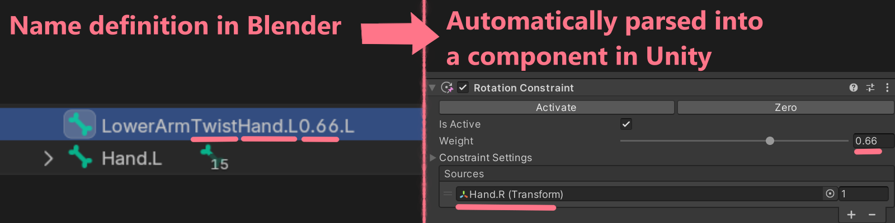

# ⛧ NNA - Node Name Abuse ⛧
Extend any 3d format by abusing node-names.\
This works by naming nodes in a specific way, and by serializing JSON into node-names.

This project is an abomination and the sooner it can burn in a fire, the better.

Issues, discussions & PRs Welcome!

## Why
Existing 3d interchange formats are bad. The least horrible one, FBX, is not extensible.

This is a way to add additional information to 3d models in any format, primarily FBX.
This Unity AssetPostprocessor will parse and convert information serialized into node-names into the appropriate Unity constructs.

The goal is for a 3d file to be the single source of truth for all its functionality, and work across different game engines.

## How
For simpler definitions, information can be encoded into a node name directly.\
For more complex components, you can serialize JSON into an array of child-nodes.

On import into Unity, these definitions will be parsed by NNA's hot loadable processors.

**[Documantation on all provided NNA components!](Docs/Components.md)**

### Name Processing
**Syntax:** `Actual Node Name` `NNA Processor Name` `Optional Parameters` `Optional Symmetry Suffix`

*Example:* `UpperLegTwistHips0.5.R`

`UpperLeg` is the actual node name.
`Twist` is the NNA processor name.
`Hips` is a parameter for the processor.
`0.5` is a parameter for the processor.
`.R` signifies the right side of the model.

Assume the following hierarchy: `Hips` → `UpperLeg.R` → `UpperLegTwist.R`.\
`UpperLegTwist.R` is supposed to be a twist-bone, as in it has to copy part of the Y-axis rotation from another node.

On import into Unity, the `Twist` node-name processor will recognize the `UpperLegTwist.R` node, and create a `RotationConstraint` with the `Hips` as the source, since it is the grandparent, and a weight of 0.5.

In order to specify a different source-node and weight, name the node the following way: `LowerArmTwistHand.L0.66.L`.
This will find the node called `Hand.L` and assign a weight of 0.66.

### Json Components
In order to specify a component with JSON, add one or more numbered child nodes to your target component.

Since to Blender allows only a maximum node-name length 61 bytes, NNA JSON definitions are split up into multiple node-names of child nodes.

Start each line/child-node with `$`, the line number, and another `$`. The remaining characters get filled with the raw JSON text. On import these lines will be combined.

The root of the JSON definition must be an array of objects. Each object has a `type` or `t` property, which is a string. Based on the objects `type`, a processor will be matched.

Example:
`Hair01`\
→ `$0$[{"t":"ava.secondary_motion","id":"0","intensity":0.4},`\
→ `$1${"t":"vrc.physbone", "overrides":["0"],`\
→ `$2$"pull":0.15,"spring":0.3, "limit_type":"angle",`\
→ `$3$"max_angle":60}]`\

Json Components can have an optional `id` and `overrides` property.\
An `id` is a string that must be unique within the model and can be used to reference other compoents.\
`overrides` is an array of id's. The overridden components will not be processed.

If you wish to not clutter your node tree with these JSON nodes throughout, you can create a single node parented to the root called `$nna`.\
It's child nodes can target nodes in the whole hierarchy with the syntax `$target:<name of the target node>`.\
In order to target the root node, whose name may not be known, due to how Blender exports files, can be targeted with `$root`. To these nodes you simply add the JSON nodes.

The previous 'Hair01' example would become:
`$nna`\
→ `$target:Hair01`\
→ → `$0$[{"t":"ava.secondary_motion","id":"0","intensity":0.4},`\
→ → `$1${"t":"vrc.physbone", "overrides":["0"],`\
→ → `$2$"pull":0.15,"spring":0.3, "limit_type":"angle",`\
→ → `$3$"max_angle":60}]`

### Global Processors
Global processors will run no matter what for the given context.

### Import Context
All processors for NNA types are registered in a context.

Processors in the default context are always applied, unless another processor for the specified import context is registered.

For example, the `c-twist` type in the default context will always create a Unity `RotationConstraint` component.
If a Processor for `c-twist` was also registered with a `vrchat_avatar3` context, and the models import context is set to that, then the VRChat specific Processor will be chosen. It would create a VRChat Constraint component instead.

## Current status
I just started making this, but generally this is how it will work.

### TODO
* More constraint types.
* More VR & V-tubing avatar components & features.
	* Bone physics (fallback, VRC Physbones & colliders & contacts, VRM spring bones & colliders, DynamicBones, MagickaCloth, VRC avatar-description colliders)
	* Automatic mapping of animator controllers
	* Automatic animator controller generation (Blocked by Blender's (lack of a legit) animation system. Will be fixed Blender 4.4 is released with its 'slotted actions'.)
		* Face Tracking
		* Hand gestures (additionally fallback VRM blendshape pose nonsense)
		* Toggles
		* Joystick puppets
* Unity Object serialisation into NNA JSON to ease asset creation.
* Template system. (To apply user modifications. This would be the basis of a 'character editor' system, so end users can adapt their avatars easier.)
* Addon system. (To apply a piece of clothing from a separate file to a base body for example. This should be deeply integrated with the avatar components.)
* Material mappings. As in map a material slot to a material, or perhaps a set of materials, within the Unity project automatically. (Later also implement the MTF subproject from STF)
* A Blender addon to make defining these components easier.
* IDK, suggest me more!

---

I am disgusted by myself for making this.

Cheers!

Or something.
