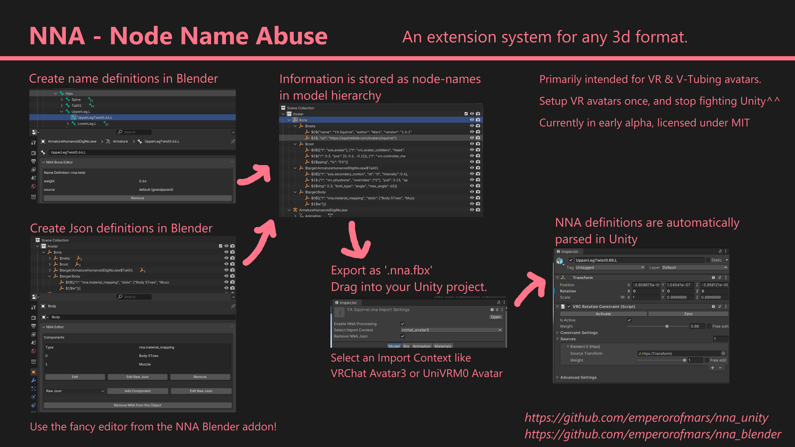

# ⛧ NNA - Node Name Abuse ⛧
#### Unity 2022+ Implementation
Extend any 3d format by abusing node-names to store data!\
This project is an abomination and the sooner it can burn in a fire, the better.\
⭐ Star this repo if you love heresy! ⭐

#### Early in development version, do not use productively!
**Install it using the VRChat Creator Companion: <https://squirrelbite.github.io/vpm/>**\
You can also install it using UPM by selecting 'Add Package from git URL'.\
Alternatively clone this repository into a Unity project's `Assets` folder.\

[Find the Blender counterpart here](https://github.com/emperorofmars/nna_blender)

---

**[Full Documantation](https://github.com/emperorofmars/nna)** - [Roadmap](https://github.com/emperorofmars/nna/blob/master/roadmap.md)

Issues, discussions & PRs welcome!

---

I am disgusted by myself for making this.

Cheers!

Or something.
