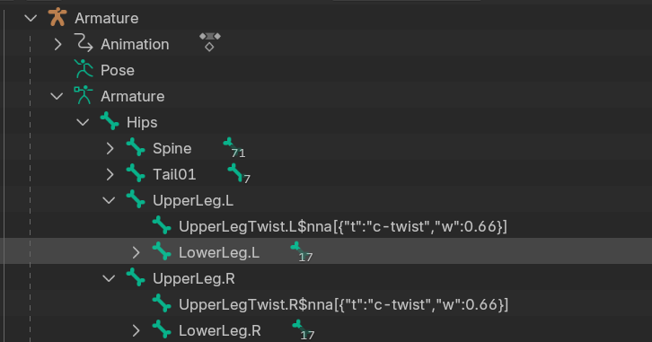

# ⛧ NNA - Node Name Abuse ⛧
Extend any 3d format by adding JSON information to node-names.

This project is an abomination and the sooner it can burn in a fire, the better.

## Purpose
Existing 3d interchange formats are bad. The least horrible one, fbx, is not extensible.

This is a way to add additional information to 3d models in any format, including fbx, as JSON into node-names.
This Unity AssetPostprocessor will parse and convert information serialized into node-names into the appropriate Unity constructs.

Since to my knowledge Blender allows only a maximum node-name length 61 bytes, NNA definitions can be split up into multiple node-names of child nodes.

## Current status
I just started making this, but generally this is how it will work.

More NNA types will be added, like humanoid definitions, perhaps comprehensive material mappings and components for VR avatars.

Support for additional types can be hot loaded.

## How it works
Assume the following hirachy: `UpperArm.L` → `LowerArm.L` → `LowerArmTwist.L`
In order to define a `c-twist` (Twist Constraint) component on the `LowerArmTwist.L` node which uses `UpperArm.L` as the source, rename it the following way:
```
LowerArmTwist.L$nna[{"t":"c-twist","w":0.5}]
```
The actual node name is `LowerArmTwist.L` and the NNA definition contains one component whose type is `c-twist`.
The NNA definition, starting with `$nna` will be removed from the node-name. If the node-name consists only of the NNA definition, the entire node will be deleted after processing.

The Parser for the type `c-twist` will create a Unity `RotationConstraint` and set the source weight to 0.6.
Since no explicit source is specified, it will take the parent of the parent as the source.

If the source was to be specified, the character limit for a node in Blender would be very likely reached.
In that case the JSON string must be split across multiple child-nodes.
The `LowerArmTwist.L` node should be named the following way:
```
LowerArmTwist.L$nna-multinode
```
The child nodes which are part of the multinode string have to start with a line number enclosed in `$` signs.
```
$01$[{"t":"c-twist","w":0.66,"t
$02$p":"../Hand.L"}]
```
I have no clue if the node-order is guaranteed to be preserved across various file-formats and their various implementations, hence the explicit line-number. The JSON string will simply be concatenated.
All child-nodes of a `$nna-multinode` will be removed after processing.

## Example
An example of a model-hirachy using NNA In Blender could look like this:


The `c-twist` component will be converted in Unity into a `RotationConstraint`:


If you wanted to define a `$nna-multinode` component in Blender, you would have to create one or more `Empty` objects and parent them to the appropriate bone. This is clunky, perhaps I will create a Blender counterpart to this eventually.

## TODO
* Target specific processors. For example a way to parse `c-twist` into Unity `RotationConstraint` in a generic use, but parse it into a VRC-Constraint in case the model is imported into a VRChat context.
* Humanoid mappings
* More constraint types
* General avatar components
* Bone physics, colliders, etc. (Find a way to deal with mutually exclusive components, likely the same way as in my [STF project](https://github.com/emperorofmars/stf-unity)).
* Material mappings. As in map a material slot to a material, or perhaps a set of materials, within the project automatically. (Very maybe implement the MTF subproject from STF)
* Make a somewhat legit UI in [UnityModelImporterInspectorExtension.cs](./Editor/UnityModelImporterInspectorExtension.cs)
* Maybe eventually a Blender addon to make defining these components easier.
* IDK, suggest me more!
---
I am disgusted by myself for making this.
Cheers!
Or something.
